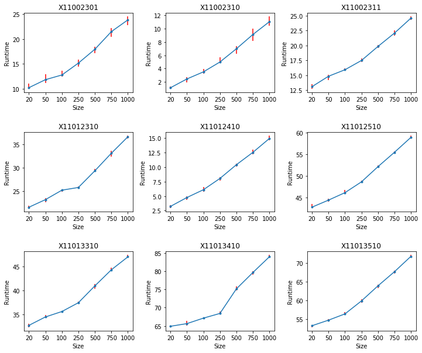
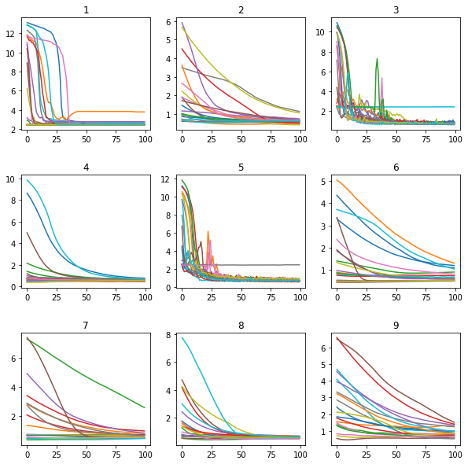

# Dec 2 - Dec 9 Progress

[Raise an issue.](https://github.com/raise-yedida/defect-prediction-dnn/issues)

## Reproduction

* Can now reproduce Lin Tan's results on PROMISE data. We have his PROMISE and AST baselines, but not his semantic features (the code to generate those are protected by a patent).
* Difference was in how `bug > 1` samples were being treated; they are now set to 1 instead of being purged.

## Experiments

* Running models with the new pre-processing on PROMISE data, they're doing better.

Results so far:

<table>
  <tr>
    <th>Dataset</th>
    <th colspan="4">Our method</th>
    <th colspan="3">MSR</th>
    <th colspan="3">Lin Tan</th>
  </tr>
  <tr>
    <th></th>
  	<th>P</th>
    <th>R</th>
    <th>F</th>
    <th>Runtime</th>
    <th>P</th>
    <th>R</th>
    <th>F</th>
    <th>P</th>
    <th>R</th>
    <th>F</th>
  </tr>
  <tr>
    <td>ant 1.5 - 1.6</td>
  	<td>51.9 (3.7)</td>
    <td>72.8 (10.9)</td>
    <td><b>59.9 (1.9)</b></td>
    <td>20.6 (0.4)</td>
    <td>33</td>
    <td>80</td>
    <td>47</td>
    <td>44.8</td>
    <td>51.1</td>
    <td>47.7</td>
  </tr>
  <tr>
    <td>ant 1.6 - 1.7</td>
  	<td>45.6 (2.7)</td>
    <td>67.5 (3.0)</td>
    <td><b>54.6 (0.7)</b></td>
    <td>37.7 (0.3)</td>
    <td>21</td>
    <td>98</td>
    <td>35</td>
    <td>41.8</td>
    <td>77.1</td>
    <td>54.2</td>
  </tr>
  <tr>
  	<td>camel 1.2 - 1.4</td>
		<td>25.6 (1.3)</td>    
    <td>55.2 (4.8)</td>
    <td>34.6 (1.4)</td>
    <td>8.6 (0.8)</td>
    <td>20</td>
    <td>82</td>
    <td>32</td>
    <td>24.8</td>
    <td>75.2</td>
    <td><b>37.3</b></td>
  </tr>
  <tr>
  	<td>camel 1.4 - 1.6</td>
    <td>28.6 (1.1)</td>
    <td>48.9 (5.9)</td>
    <td>35.9 (1.6)</td>
    <td>31.5 (0.2)</td>
    <td>28</td>
    <td>68</td>
    <td><b>40</b></td>
    <td>28.3</td>
    <td>63.7</td>
    <td>39.1</td>
  </tr>
  <tr>
  	<td>xerces 1.2 - 1.3</td>
    <td>16.1 (1.0)</td>
    <td>75.4 (17.4)</td>
    <td><b>31.3 (3.0)</b></td>
    <td>43.9 (0.3)</td>
    <td>23</td>
    <td>28</td>
    <td>26</td>
    <td>16</td>
    <td>46.4</td>
    <td>23.8</td>
  </tr>
</table>

* Where we are not SOTA yet, I will run more hyper-parameter search. The above are done with only the top-10 models, rather than top-28.

## Research Questions

### Old

* ***How far can we stray from DL literature and still do well?***

    * Hamming distance 3

* ***Can these models outperform standard DL models?***

    * Yes.

* ***Can these models outperform SOTA SE methods?***

    * In general, yes

* ***Are these models transferable to other datasets?***

    * Where transfer does NOT mean cross-project defect prediction (CPDP), generally, yes.
    * For CPDP, experiments are required

* ***Are these models scalable?***

    * Yes.

    

    ### New

* ***Why does oversampling help so much, such that the majority of models choose it?***

    * Because oversampling causes the minority class samples to contribute more to the loss, and therefore, the model cannot ignore them.
    * The performance boost from using these data points (< 5%) comes from oversampling rather than simply using them.

* ***How many epochs are really needed to train these models?***

    * About 65-75 seems to work for most models.

    

## Work for next week

* Finish experiments
* Deep learners on AST features

## Work for later

* Run cross-project defect prediction experiments
* Start writing paper (?)

## Other Discussion

* RA Paperwork?
* Journal to aim for?

